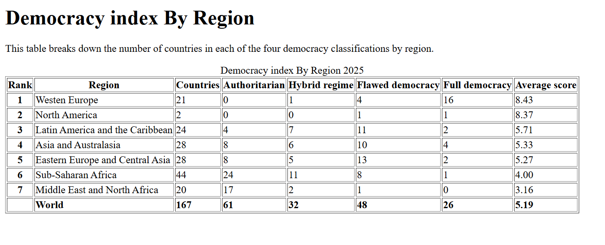
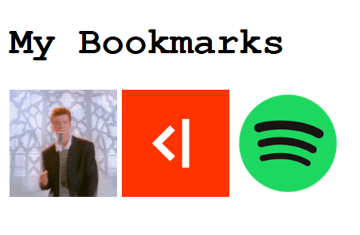
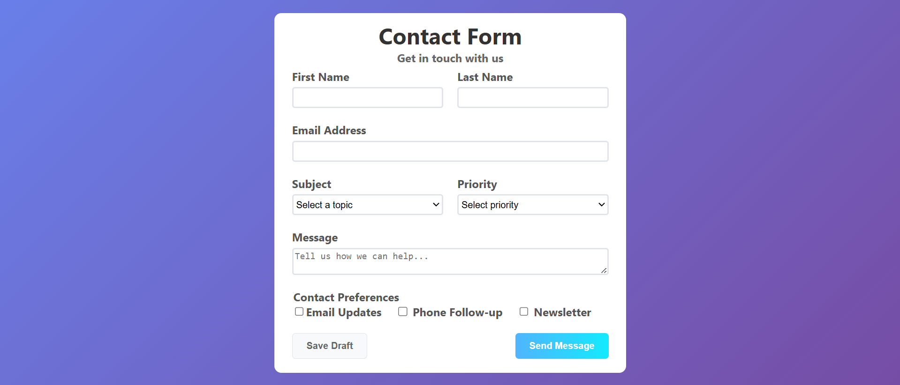
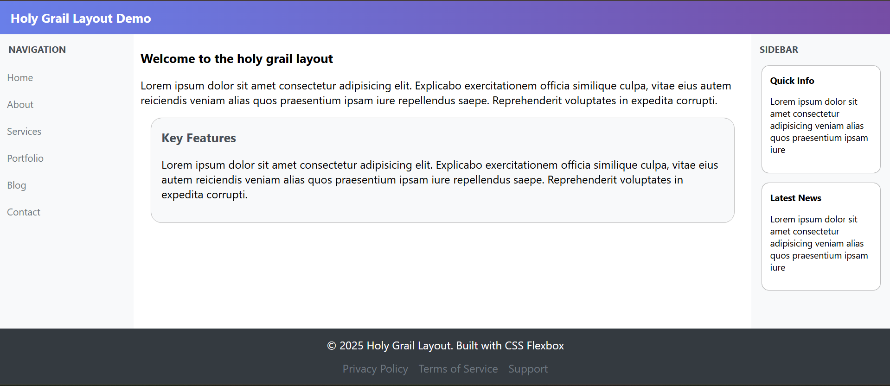

# TechTroop Assignments

A comprehensive collection of web development assignments and exercises completed during the TechTroop bootcamp. This repository covers fundamental to advanced topics in HTML, CSS, and JavaScript.

## Table of Contents

- [HTML Basics](#html-basics)
- [CSS Basics](#css-basics)
- [Advanced CSS (Flexbox, Layouts, Position)](#advanced-css)
- [Responsive Design](#responsive-design)
- [JavaScript Basics](#javascript-basics)
- [JavaScript Intermediate (Array Methods, Callbacks, 'this')](#javascript-intermediate)
- [Error Handling](#error-handling)

---

## HTML Basics

_Date: 24-05-26_

Fundamental HTML exercises focusing on structure, tags, and semantic elements.

- `exercise1.html` to `exercise5.html`

> **Screenshot Placeholder: HTML Structure**
> 

---

## CSS Basics

_Date: 25-05-26_

Introduction to styling with CSS, including selectors, properties, and the `calc()` function.

- **Basic Exercises:** `exercise1.html` through `exercise7.html`
- **Specialized Exercises (exercise8):**
  - Personal Introduction
  - Favorite Things
  - Personal Portfolio
  - Tables & Contact Forms
- **CSS Calc:** Practical use cases for dynamic sizing.

> **Screenshot Placeholder: CSS Styling**
> 

---

## Advanced CSS

_Date: 26-05-26_

Deep dive into modern layout techniques using Flexbox and CSS Positioning.

### Flexbox & Layouts

- Mastering the Flexbox container and item properties.
- Building structured page layouts.

> **Screenshot Placeholder: Flexbox Layout**
> 

### CSS Position

- Relative, Absolute, Fixed, and Sticky positioning exercises.

---

## Responsive Design

_Date: 27-05-26_

Learning to create websites that work across all device sizes using Media Queries and flexible grids.

> **Screenshot Placeholder: Responsive Viewports**
> 

---

## JavaScript Basics

_Date: 01-06-26_

Introduction to logic and programming fundamentals in JavaScript.

- Variables, Identifiers, and Operators.
- Conditional Statements (if/else, switch).
- Arrays and Basic Loops.
- Function Declarations and Expressions.

---

## JavaScript Intermediate

_Date: 02-06-26_

Advancing JavaScript skills with functional programming concepts and context management.

- **Array Methods:** `map`, `filter`, `find`, `forEach`.
- **Callbacks:** Understanding asynchronous flow and higher-order functions.
- **The 'this' Keyword:** Mastering execution context across different scenarios (Exercises 1-5).

---

## Error Handling

_Date: 08-06-26_

Robust programming techniques using `try...catch` blocks and handling exceptions gracefully.

---

## How to Run

1. **HTML/CSS:** Open any `.html` file directly in your browser.
2. **JavaScript:** Run the `.js` files using Node.js:
   ```bash
   node <filename>.js
   ```
   Or open the developer console in your browser while viewing an associated HTML file.
